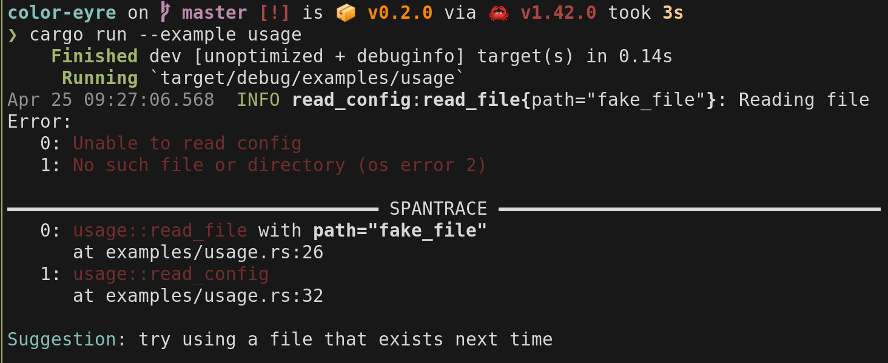
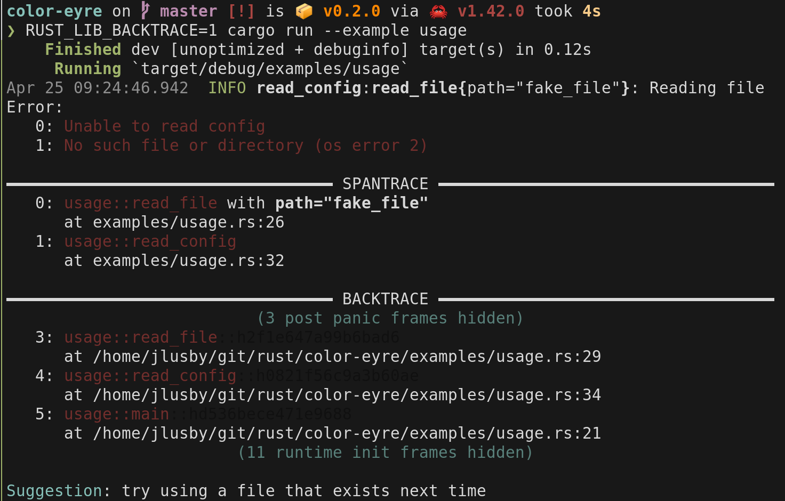
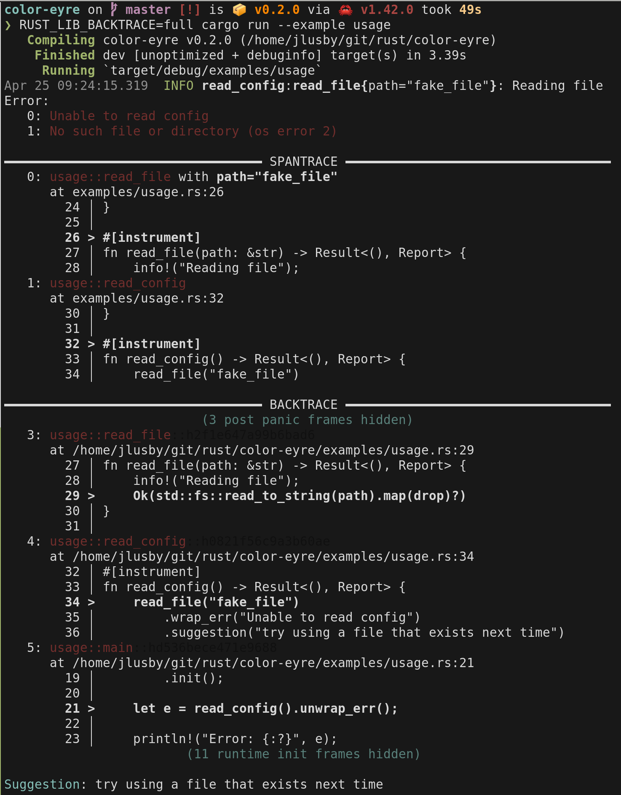

## color-eyre

[![Build Status][actions-badge]][actions-url]
[![Latest Version][version-badge]][version-url]
[![Rust Documentation][docs-badge]][docs-url]

[actions-badge]: https://github.com/yaahc/color-eyre/workflows/Continuous%20integration/badge.svg
[actions-url]: https://github.com/yaahc/color-eyre/actions?query=workflow%3A%22Continuous+integration%22
[version-badge]: https://img.shields.io/crates/v/color-eyre.svg
[version-url]: https://crates.io/crates/color-eyre
[docs-badge]: https://img.shields.io/badge/docs-latest-blue.svg
[docs-url]: https://docs.rs/color-eyre

A custom context for the [`eyre`] crate for colorful error reports, suggestions,
and [`tracing-error`] support.

## Setup

Add the following to your toml file:

```toml
[dependencies]
eyre = "0.3.8"
color-eyre = "0.2"
```

And then import the type alias from color-eyre for [`eyre::Report`] or [`eyre::Result`].

```rust
use color_eyre::Report;

// or

fn example() -> color_eyre::Result<()> {
    # Ok(())
    // ...
}
```

### Disabling tracing support

If you don't plan on using `tracing_error` and `SpanTrace` you can disable the
tracing integration to cut down on unused dependencies:

```toml
[dependencies]
eyre = "0.3.8"
color-eyre = { version = "0.2", default-features = false }
```

## Example

```rust
use color_eyre::{Help, Report};
use eyre::WrapErr;
use tracing::{info, instrument};
use tracing_error::ErrorLayer;
use tracing_subscriber::prelude::*;
use tracing_subscriber::{fmt, EnvFilter};

fn main() -> Result<(), Report> {
    let fmt_layer = fmt::layer().with_target(false);
    let filter_layer = EnvFilter::try_from_default_env()
        .or_else(|_| EnvFilter::try_new("info"))
        .unwrap();

    tracing_subscriber::registry()
        .with(filter_layer)
        .with(fmt_layer)
        .with(ErrorLayer::default())
        .init();

    Ok(read_config()?)
}

#[instrument]
fn read_file(path: &str) -> Result<(), Report> {
    info!("Reading file");
    Ok(std::fs::read_to_string(path).map(drop)?)
}

#[instrument]
fn read_config() -> Result<(), Report> {
    read_file("fake_file")
        .wrap_err("Unable to read config")
        .suggestion("try using a file that exists next time")
}
```

## Minimal Report Format



## Short Report Format (with `RUST_LIB_BACKTRACE=1`)



## Full Report Format (with `RUST_LIB_BACKTRACE=full`)



## Explanation

This crate works by defining a `Context` type which implements [`eyre::EyreContext`]
and a pair of type aliases for setting this context type as the parameter of
[`eyre::Report`].

```rust
use color_eyre::Context;

pub type Report = eyre::Report<Context>;
pub type Result<T, E = Report> = core::result::Result<T, E>;
```

## Features

- captures a [`backtrace::Backtrace`] and prints using [`color-backtrace`]
- captures a [`tracing_error::SpanTrace`] and prints using
[`color-spantrace`]
- Only capture SpanTrace by default for better performance.
- display source lines when `RUST_LIB_BACKTRACE=full` is set
- store help text via [`Help`] trait and display after final report


[`eyre`]: https://docs.rs/eyre
[`tracing-error`]: https://docs.rs/tracing-error
[`color-backtrace`]: https://docs.rs/color-backtrace
[`eyre::EyreContext`]: https://docs.rs/eyre/0.3.8/eyre/trait.EyreContext.html
[`backtrace::Backtrace`]: https://docs.rs/backtrace/0.3.46/backtrace/struct.Backtrace.html
[`tracing_error::SpanTrace`]: https://docs.rs/tracing-error/0.1.2/tracing_error/struct.SpanTrace.html
[`color-spantrace`]: https://github.com/yaahc/color-spantrace
[`Help`]: trait.Help.html
[`eyre::Report`]: https://docs.rs/eyre/0.3.8/eyre/struct.Report.html
[`eyre::Result`]: https://docs.rs/eyre/0.3.8/eyre/type.Result.html

#### License

<sup>
Licensed under either of <a href="LICENSE-APACHE">Apache License, Version
2.0</a> or <a href="LICENSE-MIT">MIT license</a> at your option.
</sup>

<br>

<sub>
Unless you explicitly state otherwise, any contribution intentionally submitted
for inclusion in this crate by you, as defined in the Apache-2.0 license, shall
be dual licensed as above, without any additional terms or conditions.
</sub>
